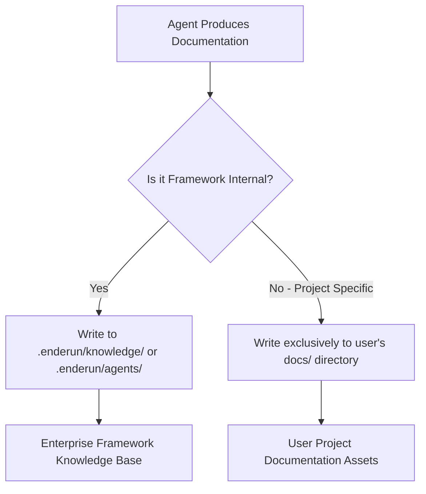

# Documentation Ownership Standard

> **Trace ID:** 01HGT8J5E2N0W0W0W0W0W0W0W4  
> **Status:** ACTIVE  
> **Applicability:** All Agent Enderun Framework Components and Subagents

---

## 🏛️ 1. Overview & Core Philosophy

In a high-integrity agentic development environment, keeping a strict separation of concerns between the **Agent Enderun Framework** and the **User's Application Codebase** is critical. Documentation is no exception.

This standard defines the boundary of where documentation can and must be written. Any deviation from this policy is treated as a major architectural governance violation and will be flagged immediately by `@manager`.

---

## 🚫 2. The Framework Boundary

To maintain portability and avoid cluttering the core framework directory, agents must strictly follow the directory permissions:

1. **Framework Directories (`.enderun/` or `{{FRAMEWORK_DIR}}`)**:
   - **Allowed**: Core system configurations, internal agent instructions, status metrics, and global, generic framework-level architectural patterns.
   - **Strictly Prohibited**: Any user-project specific research, implementation details, API guides, component documentation, database schemas, or deployment instructions.

2. **User Application Directories (e.g., `docs/`, `apps/`, `src/`)**:
   - **Mandatory**: All project-specific architectural decisions (ADRs), layout specs, technical guides, system integration plans, API specifications, and research findings must be written **exclusively** into the user's own `docs/` directory.

---

## 📝 3. User Project `docs/` Structure

When producing user-facing documentation, agents must use a clean, logical structure inside the user's `docs/` directory:

- `/docs/architecture/` — Architectural Decision Records (ADRs), system designs, database schemas.
- `/docs/api/` — API route documentation, contract hashes, payload structures.
- `/docs/guides/` — Developer onboarding, building, running, and troubleshooting the specific application.
- `/docs/research/` — Third-party library evaluations, performance benchmarks, and exploration logs.

---

## 🚨 4. Enforcement & Governance

- **Zero-Tolerance Audit**: During any code review or check command (e.g., `agent-enderun check`), `@manager` or `@quality` will verify if any files have been erroneously created in `.enderun/knowledge/`.
- **Auto-Correction**: Any violating file will be immediately moved to the appropriate user-project `docs/` directory, and a warning log carrying the active Trace ID will be raised.
